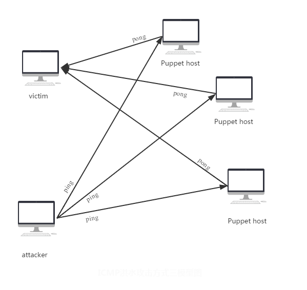
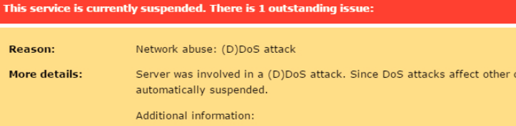

# DDoS-Practice

My experiment to practice three types of ICMP DDoS attack.

Just for fun.

### Three types

* normaldos: Just a simple icmp dos tool.
* fakeipdos: Disguising as someone else and launch an dos attack.
* DDoS: Launch a distrubuted dos attack, let many other machine attack you victim.

### Usage:

```shell
sudo ./normaldos <target ip>
sudo ./fakeipdos <target ip> <fake ip>
sudo ./ddos <target ip> <start ip> <end ip>
```

### principle



## Some comments

这个程序只是拿来练习测试而已，仅供学习，不要乱搞事。以下是拿一台服务器测试的后果，服务器被封掉了（我只是测试而已，我也很绝望啊）。

和谐上网，与人为善，好好学习！

